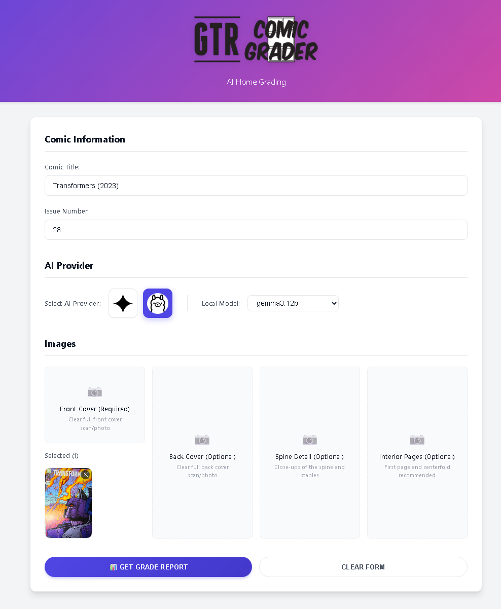
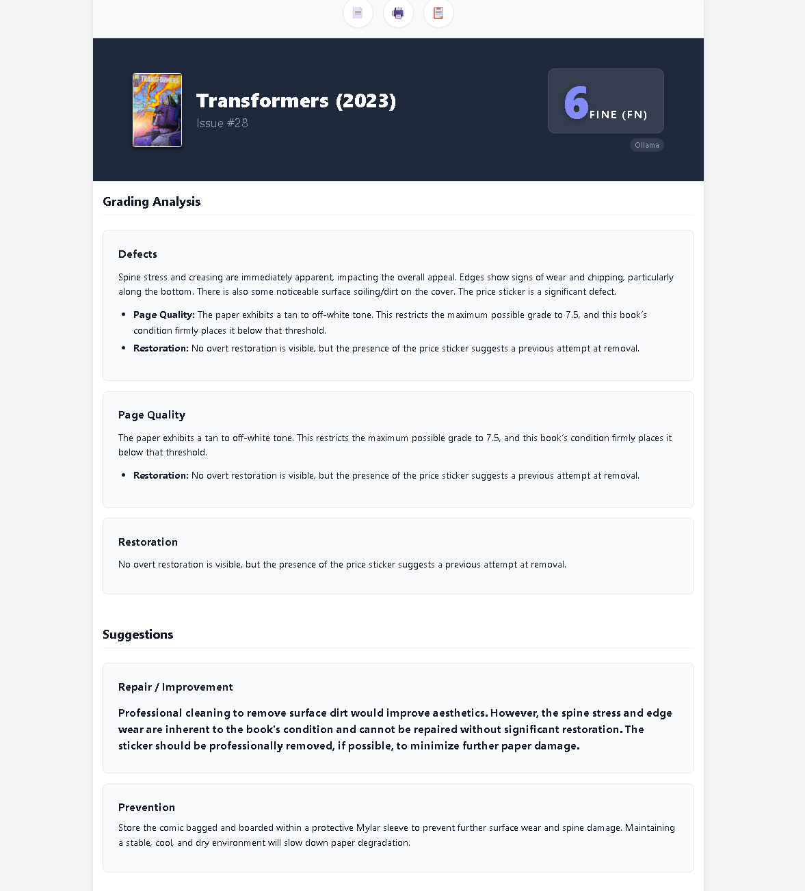

# 🎨 GTR Comic Grader

> **Professional AI-Powered Comic Book Grading & Restoration Detection**

[](https://github.com/GeekTekRob/gtr_comiic_grader/actions)
[](https://opensource.org/licenses/MIT)
[](https://www.docker.com/)
[](https://reactjs.org/)
[](https://vitejs.dev/)

**GTR Comic Grader** bridges the gap between subjective human grading and objective analysis. By leveraging multimodal AI models (Gemini 1.5 Pro, GPT-4o, Claude 3.5 Sonnet), it analyzes high-resolution comic book images to detect defects, assess page quality, identify restoration, and assign a grade based on CGC standards.

---

## ✨ Features

<table>
  <tr>
    <td width="50%">
      <h3>🧠 Multi-Model AI Analysis</h3>
      <p>Choose your expert. Switch seamlessly between <strong>Google Gemini</strong> (Free Tier), <strong>OpenAI GPT-4o</strong>, or <strong>Anthropic Claude 3.5</strong> to find the grading style that matches your preference.</p>
    </td>
    <td width="50%">
      <h3>📏 CGC Standard Grading</h3>
      <p>Strict adherence to the 10-point CGC grading scale (0.5 - 10.0). Our system understands nuances like "Off-White to White" pages and how defects impact the final grade.</p>
    </td>
  </tr>
  <tr>
    <td width="50%">
      <h3>🔍 Restoration Detection</h3>
      <p>Identify hidden modifications. The AI scans for signs of trimming, color touch-ups, tear seals, and cleaning that can drastically alter a comic's value.</p>
    </td>
    <td width="50%">
      <h3>📄 Detailed Reporting</h3>
      <p>Generate comprehensive reports in <strong>HTML</strong>, <strong>JSON</strong>, or <strong>Markdown</strong>. Includes grading notes, defect coordinates, and improvement suggestions.</p>
    </td>
  </tr>
</table>

---

## 📸 Interface Preview

### 1. Smart Upload & Analysis

_Drag and drop your covers, spines, and interior pages. The system optimizes clear scanning for the best AI results._


_(Place `upload_preview.png` in docs/screenshots)_

### 2. Comprehensive Grading Reports

_Receive a clean, professional report with the calculated grade, defect analysis, and conservation checks._


_(Place `report_preview.png` in docs/screenshots)_

---

## 🚀 Quick Start

Get up and running in minutes.

### Method 1: Docker (Recommended)

The cleanest way to run the application without installing Node.js locally.

1.  **Configure Environment**
    Create a `.env` file in the root directory:

    ```bash
    GEMINI_API_KEY=your_key_here
    GEMINI_MODEL=gemini-1.5-flash
    ```

2.  **Launch**

    ```bash
    docker compose up -d
    ```

3.  **Access**
    Open [http://localhost:5000](http://localhost:5000)

### Method 2: Local Development

For developers who want to modify the source code.

1.  **Install Dependencies**

    ```bash
    npm run setup
    ```

2.  **Start Development Server**
    ```bash
    npm run dev
    ```

---

## 🛠️ Tech Stack

- **Frontend:** React 18, Vite, CSS
- **Backend:** Node.js, Express
- **AI Integration:** Google Generative AI SDK, OpenAI Node SDK, Anthropic SDK
- **Containerization:** Docker, Docker Compose

---

## 📚 Documentation

Detailed documentation is located in the [`docs/`](docs/) folder.

- [**Setup Guide**](docs/SETUP.md) - Manual installation & API key configuration.
- [**Docker Setup**](docs/DOCKER_SETUP.md) - Advanced container configuration.
- [**API Reference**](docs/API.md) - Backend endpoints and schemas.

---

## 🤝 Contributing

Contributions are welcome! Please feel free to submit a Pull Request.

1.  Fork the Project
2.  Create your Feature Branch (`git checkout -b feature/AmazingFeature`)
3.  Commit your Changes (`git commit -m 'Add some AmazingFeature'`)
4.  Push to the Branch (`git push origin feature/AmazingFeature`)
5.  Open a Pull Request
